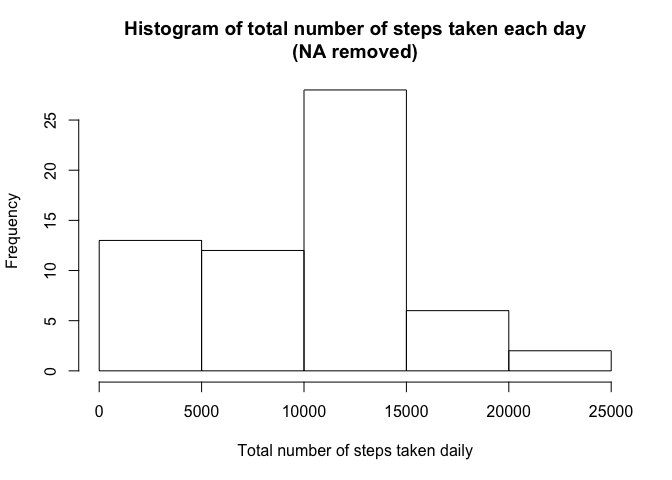
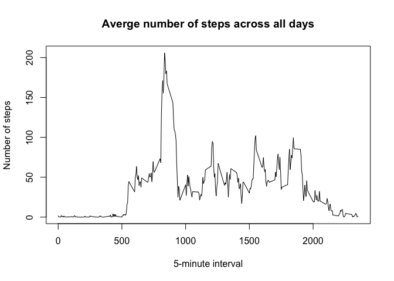
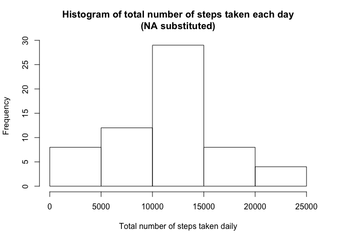
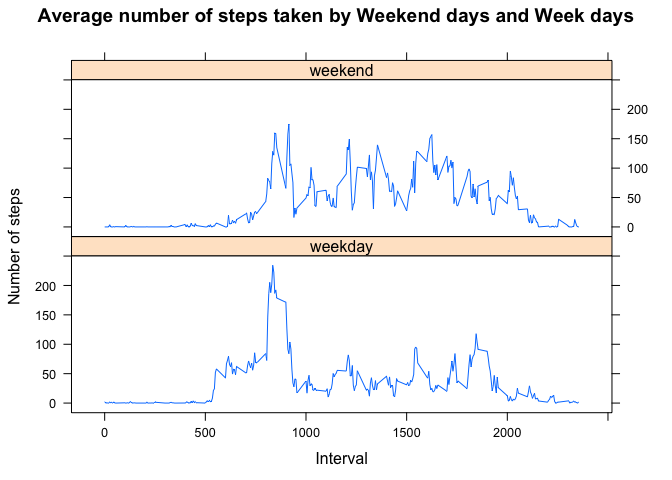

# Reproducible Research: Peer Assessment 1


## Loading and preprocessing the data


```r
library(plyr)
```

```
## Warning: package 'plyr' was built under R version 3.1.3
```

```r
library(lattice)
steps = read.csv("activity.csv")
steps$date = as.Date(steps$date)
```


## What is mean total number of steps taken per day?

1- The following code calculate the total number of steps making by day and gives the result:


```r
steps_by_day <- ddply(steps,"date",transform,steps=sum(steps,na.rm = TRUE))
steps_by_day <- subset(steps_by_day,!duplicated(date))
with(steps_by_day,sum(steps))
```

```
## [1] 570608
```

As we can see, the function ddply is used for sum the steps of each day, with the exclusion of NA values (parameter "na.rm" set as TRUE).

2- Here we show a histogram of the total number of steps taken each day:

 

3- Finally we calculated the mean and median of the total number of steps taken per day


```r
with(steps_by_day,mean(steps))
```

```
## [1] 9354.23
```

```r
with(steps_by_day,median(steps))
```

```
## [1] 10395
```

## What is the average daily activity pattern?

1- Make a time series plot (i.e. type = "l") of the 5-minute interval (x-axis) and the average number of steps taken, averaged across all days (y-axis)


```r
steps_daily <- ddply(steps,"interval",transform,steps=mean(steps,na.rm = TRUE))
steps_daily <- subset(steps_daily,!duplicated(interval))

with(steps_daily,plot(interval,steps,type="l",xlab="5-minute interval",ylab="Number of steps",main="Averge number of steps across all days"))
```

 

2- Which 5-minute interval, on average across all the days in the dataset, contains the maximum number of steps?


```r
steps_daily$interval[which.max(steps_daily$steps)]
```

```
## [1] 835
```

## Imputing missing values

1- Calculate and report the total number of missing values in the dataset (i.e. the total number of rows with NAs)


```r
with(steps,sum(is.na(steps)))
```

```
## [1] 2304
```

2- Devise a strategy for filling in all of the missing values in the dataset. The strategy does not need to be sophisticated. For example, you could use the mean/median for that day, or the mean for that 5-minute interval, etc.

The strategy that will be adopted is fill the missing values with the mean for that 5-minute interval.

3- Create a new dataset that is equal to the original dataset but with the missing data filled in.


```r
interval_mean <- ddply(steps,"interval",transform,steps=mean(steps,na.rm = TRUE))$steps

nas <- with(steps,which(is.na(steps)))
new_dataset <- steps
new_dataset$steps[nas] <- interval_mean[nas]
```

4- Make a histogram of the total number of steps taken each day.


```r
total_steps_by_day_without_nas <- ddply(new_dataset,"date",transform,steps=sum(steps))
total_steps_by_day_without_nas <- subset(total_steps_by_day_without_nas,!duplicated(date))
with(total_steps_by_day_without_nas,hist(steps,xlab="Total number of steps taken daily", main="Histogram of total number of steps taken each day\n(NA substituted)"))
```

 

Calculate and report the mean and median total number of steps taken per day.


```r
with(total_steps_by_day_without_nas,mean(steps))
```

```
## [1] 10889.8
```

```r
with(total_steps_by_day_without_nas,median(steps))
```

```
## [1] 11015
```

These values differ from the estimates from the first part the assignment. The impact of imputing missing data elevated the total daily number of steps.

## Are there differences in activity patterns between weekdays and weekends?

1- Create a new factor variable in the dataset with two levels - "weekday" and "weekend"" indicating whether a given date is a weekday or weekend day.


```r
steps = cbind(steps,weekdays(steps$date))
names(steps)[length(names(steps))] = "daylevel"
steps$daylevel = as.factor(unlist(lapply(steps$daylevel,function(x) if(x=="Saturday"||x=="Sunday") x="weekend" else x="weekday")))
```

2- Make a panel plot containing a time series plot (i.e. type = "l") of the 5-minute interval (x-axis) and the average number of steps taken, averaged across all weekday days or weekend days (y-axis). See the README file in the GitHub repository to see an example of what this plot should look like using simulated data.


```r
steps_week <- aggregate(steps ~ interval + daylevel,data = steps,FUN=mean,na.rm=TRUE)
head(steps_week)
```

```
##   interval daylevel     steps
## 1        0  weekday 2.3333333
## 2        5  weekday 0.4615385
## 3       10  weekday 0.1794872
## 4       15  weekday 0.2051282
## 5       20  weekday 0.1025641
## 6       25  weekday 1.5128205
```

```r
xyplot(steps ~ interval | daylevel, steps_week, type="l",layout=c(1,2),xlab="Interval",ylab="Number of steps", main="Average number of steps taken by Weekend days and Week days")
```

 
